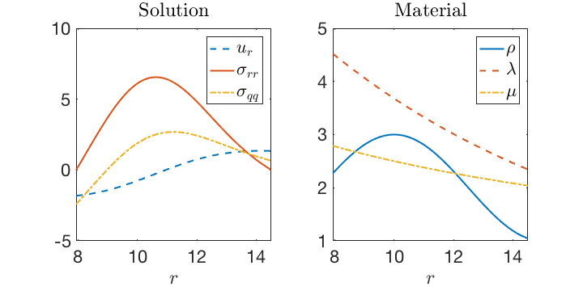

Construction of Modal Solution on a Heterogeneous Spherical Shell
=================================================================

A [Chebfun](http://www.chebfun.org/) script for creating a modal solution for
linear elasticity on a radially heterogeneous spherical shell.

Readable Version of README.md
-----------------------------

A *more* readable version of this document can be generated with
[pandoc](http://pandoc.org/)

```
pandoc README.md -o README.pdf
```

Synopsis
--------

The purpose of the MATLAB Chebfun script `shell.m` is to construct a high-order
approximation of a modal solution to a radially heterogeneous, isotropic
elastic shell. If $u_{r}$, $u_{\theta}$, $u_{\phi}$ are the displacements in
a spherical coordinate system, then the solution is taken to be of the form
$u_{r} = \cos(t) \phi(r)$ and $u_{\phi} = u_{\theta} = 0$.

The script specifies the material properties using the density $\rho$, Lamé's
first parameter $\lambda$, and Lamé's second parameter $\mu$ (i.e., the shear
modulus). The inner and outer radii of the shell are chosen so that the
resulting boundary condition is traction free (free surface). Specifically, once
$\phi(r)$ is determined the radii are chosen to be zeros of
$$
  \sigma_{rr} = \left(\lambda + 2\mu\right) \phi_{,r} +
                \frac{2}{r}\lambda \phi,
$$
where the comma in the subscripts denotes a partial derivative with respect to
the variable that follows.

The script outputs the inner and outer radii of the spherical shell (`R1` and
`R2`) as well as information needed to build a polynomial interpolant (via
barycentric interpolation) of the solution. The full output of the script is
given in `shell_data.m`.

To convert from the spherical to Cartesian system the following transforms of
the radial displacement $u_{r}$ and the derivative $u_{r,r}$ can be used (from
which the stresses and/or strains can be defined)

$$ u_{x}   = \frac{x}{r} u_{r}, \quad
   u_{y}   = \frac{y}{r} u_{r}, \quad
   u_{z}   = \frac{z}{r} u_{r}, $$

$$ u_{x,x} = \frac{x^2 r u_{r,r} + y^2 u_{r} + z^2 u_{r}}{r^3}, \quad
   u_{x,y} = \frac{x y (r u_{r,r} - u_r)}{r^3}, \quad
   u_{x,z} = \frac{x z (r u_{r,r} - u_r)}{r^3}, $$

$$ u_{y,x} = \frac{y y (r u_{r,r} - u_r)}{r^3}, \quad
   u_{y,y} = \frac{y^2 r u_{r,r} + x^2 u_{r} + Z^2 u_{r}}{r^3}, \quad
   u_{y,z} = \frac{y z (r u_{r,r} - u_r)}{r^3}, $$

$$ u_{z,x} = \frac{z y (r u_{r,r} - u_r)}{r^3}, \quad
   u_{z,y} = \frac{z y (r u_{r,r} - u_r)}{r^3}, \quad
   u_{z,z} = \frac{z^2 r u_{r,r} + x^2 u_{r} + y^2 u_{r}}{r^3}. $$

Plots of the non-zero components of the solution and the material properties are
shown in the figure



Dependencies
------------

 * [MATLAB](https://www.mathworks.com/)
 * [Chebfun](http://www.chebfun.org/)

License
-------

[Creative Commons Zero v1.0 Universal](http://creativecommons.org/publicdomain/zero/1.0/)
